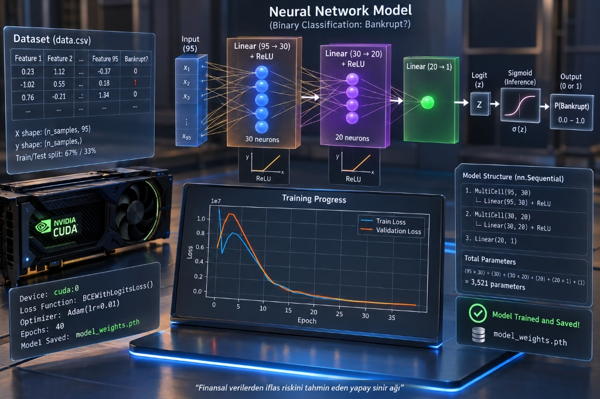

# AI Bankruptcy Risk Prediction (Yapay Sinir Ağı ile İflas Riski Tahmini)

Bu proje, şirketlerin finansal verilerini kullanarak **"Bankrupt?" (İflas Riski)** ikili sınıflandırması (binary classification) yapan, önceden eğitilmiş PyTorch yapay sinir ağı modelini (`model_weights.pth`) bir web arayüzü ile sunar.

**Veri seti:** 6.819 şirket, 95 finansal oran, hedef sütun `Bankrupt?`. Şirketlerin %3,2'si iflas etmiştir; yani veri çok dengesizdir. (Bu yapı, Tayvan Ekonomi Dergisi'nin 1999–2009 verisine dayanan, Kaggle/UCI'de "Taiwanese Bankruptcy Prediction" adıyla bilinen setle aynıdır.)

---

## 🏗️ Model Mimarisi

<p align="center">
  
</p>

Model mimarisi aşağıdaki katmanlardan oluşmaktadır:
```
95 Giriş Özelliği → 30 Nöron (ReLU) → 20 Nöron (ReLU) → 1 Çıktı (Logit)
```
- **Loss Fonksiyonu (Eğitimde):** `BCEWithLogitsLoss`
- **Inference Sırasında:** Modelin sonuna ek bir Sigmoid katmanı eklenmez; tahmin anında `torch.sigmoid(logit)` ile olasılık hesaplanır.
- **Karar Kuralı:**
  - `probability >= 0.5` $\rightarrow$ **Bankrupt (1)**
  - `probability < 0.5` $\rightarrow$ **Non-Bankrupt (0)**
- **Feature Sıralaması:** 95 finansal özelliğin sırası doğrudan `data.csv` dosyasından okunur ve birebir korunur.
- **Model Yükleme:** Model ağırlıkları uygulama başlangıcında yalnızca **bir kez** hafızaya alınır (`model.eval()`).

---

## 📁 Proje Dosya Yapısı

```
AI-Bankruptcy-Risk-Prediction/
│
├── main.py                 # Model eğitimi ve görselleştirme (NVIDIA GPU ister)
├── model_weights.pth       # Eğitilmiş PyTorch model ağırlıkları
├── data.csv                # Veri seti (95 özellik + 1 hedef sütun)
├── requirements.txt        # Gerekli kütüphaneler
├── README.md               # Kurulum ve çalıştırma kılavuzu
├── baslat.bat / start.bat  # Web arayüzünü tek tıkla başlatır
├── assets/                 # Model mimarisi görseli
├── tests/                  # API duman testi
│
└── web_app/                # Web Arayüzü ve Servis Klasörü
    ├── main.py             # FastAPI backend servisi & PyTorch model inference
    ├── templates/
    │   └── index.html      # Modern, finansal AI dashboard şablonu
    └── static/
        ├── style.css       # Koyu lacivert finans/AI teması, responsive 3 sütunlu grid
        └── script.js       # Form doğrulama, hızlı test butonları, API haberleşmesi
```

---

## 🚀 Kurulum ve Çalıştırma Adımları

### 1. Gereksinimlerin Yüklenmesi
Terminal veya PowerShell üzerinden proje klasöründe şu komutu çalıştırın:

```bash
pip install -r requirements.txt
```

Web arayüzü CPU'da çalışır. Modeli yeniden eğitmek için (`python main.py`) NVIDIA GPU gerekir, çünkü betik tüm tensörleri CUDA'ya taşır.

### 2. Web Arayüzünü Başlatma

Arayüzü başlatmak için en pratik yöntem:

#### Yöntem 1 (Tek Tıkla Başlatma - Tavsiye Edilen):
Kök dizindeki **`baslat.bat`** (veya `start.bat`) dosyasına çift tıklayın.
- Python ortamını ve kütüphaneleri otomatik tespit eder.
- FastAPI sunucusunu başlatır.
- Tarayıcınızı (`http://127.0.0.1:8000`) otomatik olarak açar!

#### Yöntem 2 (Terminal / Komut Satırı ile):
```bash
cd web_app
uvicorn main:app --reload
```
veya kök dizinden:
```bash
uvicorn web_app.main:app --reload
```

Sunucu varsayılan olarak `http://127.0.0.1:8000` adresinde çalışmaya başlayacaktır.

### 3. Tarayıcıdan Erişilmesi
Web tarayıcınızı açarak aşağıdaki adrese gidin:

👉 **[http://127.0.0.1:8000](http://127.0.0.1:8000)**

---

## 🖥️ Web Arayüzü Özellikleri

1. **Otomatik 95 Feature Girişi:** `data.csv`'deki 95 özelliğin tamamı gerçek adlarıyla ve doğru sırayla input alanı olarak oluşturulur.
2. **Responsive Tasarım:** Masaüstü ekranlarda **3 sütunlu grid**, mobil cihazlarda **tek sütunlu** kompakt görünüm.
3. **Hızlı Test Butonları (Quick Test Data):**
   - **Load Healthy Sample:** `data.csv`'den gerçek bir sağlıklı şirket örneğini otomatik doldurur.
   - **Load Bankrupt Sample:** `data.csv`'den gerçek bir iflas riski olan şirket örneğini otomatik doldurur.
   - **Fill Averages:** Veri setinin ortalama değerlerini doldurur.
   - **Clear All:** Tüm alanları temizler.
4. **Canlı Özellik Arama:** 95 özellik arasında aradığınız metriği (örneğin *ROA*, *Margin*, *Debt*) anında filtrelemenizi sağlayan arama çubuğu.
5. **Görsel Risk Raporu:** Tahmin sonucunda iflas durumu (**Bankrupt** veya **Non-Bankrupt**), risk yüzdesi ve renkli ilerleme çubuğu (progress gauge) anında gösterilir.
6. **Validasyon & Hata Kontrolü:** Boş bırakılan alanlar, sayısal olmayan veya NaN/sonsuz değerler hem frontend hem backend tarafında yakalanarak kullanıcı uyarılır.

---

## 🔌 API Endpoint'leri

### 1. `POST /predict`
95 özelliğin değerlerini alır, `[1, 95]` boyutunda `torch.float32` tensör oluşturur ve model tahminini döner.

**Örnek İstek (Request Body):**
```json
{
  "features": {
    " ROA(C) before interest and depreciation before interest": 0.370594,
    "... (95 özellik)": 0.0
  }
}
```

**Yanıt biçimi (Response):**
```json
{
  "prediction": 0,
  "probability": 0.4103,
  "percentage": 41.03
}
```

`prediction` 1 ise iflas riski, 0 ise sağlam; `probability` modelin iflas olasılığıdır.

### 2. `GET /api/sample?type={bankrupt|non_bankrupt|mean}`
Arayüzden tek tıkla test yapılabilmesi için veri setinden örnek veri döner.

---

## 📉 Modelin mevcut başarımı (dürüst değerlendirme)

Kayıtlı `model_weights.pth`, eğitimdeki ayrımla (`test_size=0.33`, `random_state=42`) aynı 2.251 şirketlik test kümesinde ölçüldü:

| Ölçüt | Değer |
|---|---:|
| Doğruluk | %96,3 |
| Her şirkete "sağlam" diyen modelin doğruluğu | %96,4 |
| Yakalanan iflas (81 iflas vakası içinde) | **0** (duyarlılık %0) |
| ROC AUC | 0,50 |
| Çıktı olasılığı | Test kümesinin %99'undan fazlasında sabit 0,4103 |

Yani model şu anda iflas eden ve etmeyen şirketi **ayırt edemiyor**. Yüksek doğruluk, verinin %96,8'inin zaten sağlam şirket olmasından geliyor. Arayüz ve API doğru çalışır, ancak verdikleri risk yüzdesi bu nedenle anlamlı değildir.

**Olası nedenler:**
- Özellikler ölçeklenmemiş: bazı sütunlar 0–1 aralığındayken bazıları 10¹⁰'a kadar çıkıyor. Bu, ReLU nöronlarını ya hep kapalı ya hep doygun bırakıyor.
- Sınıf dengesizliği (%3,2): kayıp fonksiyonu azınlık sınıfını neredeyse görmüyor.
- Eğitim yalnızca 39 tam-toplu adım sürüyor.

**Düzeltme için öneriler** (eğitim betiğinde):
- `StandardScaler` ya da log dönüşümü uygulayın; aynı dönüşümü web uygulamasında da kullanın.
- `BCEWithLogitsLoss(pos_weight=...)` ile iflas sınıfına ağırlık verin.
- Daha uzun eğitim ve doğrulama kümesine göre erken durma kullanın.
- Karar eşiğini 0,5 yerine duyarlılık/kesinlik dengesine göre seçin.
- Doğruluk yerine duyarlılık, kesinlik, F1 ve ROC AUC raporlayın.

---

## ⚠️ Bilgilendirme ve Uyarı
Sayfada yer alan model mimarisi ve uyarı metinleri:
- **Model Architecture:** `95 Inputs → 30 ReLU → 20 ReLU → 1 Output`
- **Classification:** `Neural Network Binary Classification Model`
- **Uyarı:** *"This model is an experimental decision-support prototype and should not be considered financial advice."*

## 🧪 Test

```bash
pip install pytest httpx
python -m pytest tests -q
```

Test, API'nin modeli yüklediğini, üç örnek şirket için geçerli bir olasılık döndürdüğünü ve boş isteği reddettiğini denetler. Yalnızca CPU kullanır, birkaç saniyede biter.
